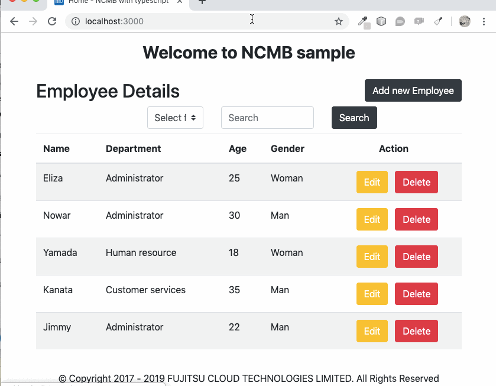

# NCMB SDK implement with typescript + nodejs
## **Employee Management**  
NCMB SDKを利用して、Typescriptとnodejsで実装しているサンプルアプリです。

社員を追加、編集、削除や検索機能の社員管理アプリです。


# アプリの機能:
* [x] 新社員を追加
* [x] 社員の情報を編集
* [x] 名前、部分、年齢、性別などの条件で検索
* [x] 社員を削除

# 内容:
- [ニフクラ mobile backendって何？？](#ニフクラ-mobile-backendって何？？)  
- [動作環境](#動作環境)  
- [手順](#手順)  
- [参考](#参考)

# ニフクラ mobile backendって何？？
* スマートフォンアプリのバックエンド機能（プッシュ通知・データストア・会員管理・ファイルストア・SNS連携・位置情報検索・スクリプト）が開発不要、しかも基本無料(注1)で使えるクラウドサービス！
* 注1：詳しくは[こちら](https://mbaas.nifcloud.com/price.htm)をご覧ください


# 動作環境
ローカル化するように以下の手順をご実装ください:
1. インストール [Node.js](https://nodejs.org/en/)
1. インストール [VS Code](https://code.visualstudio.com/)
1. インストール [Typescript](https://www.npmjs.com/package/typescript)  
`npm`経由でTypeScriptがインストールやすくなります。

```
npm install -g typescript
```

# 手順

## 1. ニフクラウドアカウントの登録・新規アプリを作成
- [ニフクラウドmobile backend の会員登録](https://console.mbaas.nifcloud.com/signup)・ログインとアプリの新規作成
- 上記リンクから会員登録（無料）をします。登録ができたらログインをすると下図のように「アプリの新規作成」画面が出るのでアプリを作成します
  
- アプリ作成されると下図のような画面になります
- この２種類のAPIキー（アプリケーションキーとクライアントキー）があります
  

## 2. GitHubからサンプルプロジェクトのダウンロード
```
git clone --depth=1 https://github.com/vfa-tamhh/ncmb_typescript.git <project_name>
```
- dependenciesをインストールします
```
cd <project_name>
npm install
```
## 3. VScodeでアプリを起動

- VScodeを開いて、Fileから、Openで適当なプロジェクトを選択します。

- フォルダは下図ような画面となります。


## 4. APIキーの設定

- `.env`ファイルを開いて、それぞれYOUR_NCMB_APPLICATION_KEYとYOUR_NCMB_CLIENT_KEYの部分を書き換えます。


## 5. アプリのデータを準備
ニフクラ mobile backendにログインして、"Create"で"Import"を選択します。
  

- `Data/employee.json`ファイルを選択してインポートします。クラス名を`Employee` にします。
  

- インポート後のデータは以下のとおりです。
  

## 6. ビルドを実施・結果を確認

```
cd <project_name>
npm run build
npm run start
```
- ブラウザで`http://127.0.0.1:3000`へアクセスします。
- `[Add new Employee]`ボタンで社員を追加します。

- 下図のような画面の情報を入力して、"Save" ボタンを押します。

- ニフクラウドコンソールで結果を確認します。


# 参考
  ## 1. 構造を説明
  
コンパイル後、`src`フォルダのTypeScript (`.ts`)は`dist`フォルダのJavaScript (`.js`)になります。
`views`フォルダは親フォルダにあります。

各フォルダの内容は以下の通りです。

> **注意** `npm run build`でアプリのビルドを完了したはずです。

| フォルダ | 説明 |  
| ------------------------ | --------------------------------------------------------------------------------------------- |  
| **dist**                 | ビルド後のコードを含む                                                      |  
| **node_modules**         | 全てのnpm dependenciesを含む                                                 |  
| **src**                  | typescriptのコードを含み、コンパイル後で  distフォルダに位置する。               |  
| **src/controllers**      | HTTPからリクエストのリダイレクトファイルを含む                                                    |  
| **src/public**           | Front endのファイルを含む                                                        |  
| **src/types**            | ncmb.d.tsファイルを含む                                                        |  
| **src**/server.ts        | Entry point to your express app                                                               |  
| **views**                | HTMLをRenderする用Pug templateファイルを含む                                           |  
| .env             　　　　 | `YOUR_APPLICATION_KEY` と `YOUR_CLIENT_KEY`を含む    |  
| .copyStaticAssets.ts     | distへ画像、css, jsをコピーするスクリプトだ                                     |  
| package.json             | 案件で使用しているdependenciesを含む                                               |  
| tsconfig.json            | TypeScriptのコンパイル設定を含む                                               |  

### TypeScriptのコンパイル設定
- コンパイルを設定するように`tsconfig.json` ファイルを使用しています。 コンフィッグ設定はこちらの[参考](https://www.typescriptlang.org/docs/handbook/tsconfig-json.html) をご確認ください。

```json
"compilerOptions": {
    "module": "commonjs",
    "esModuleInterop": true,
    "target": "es6",
    "noImplicitAny": false,
    "moduleResolution": "node",
    "sourceMap": true,
    "outDir": "dist",
    "baseUrl": ".",
    "paths": {
        "*": [
            "node_modules/*",
            "src/types/*"
        ]
    }
},
"include": [
    "src/**/*.ts"
]
```
  ## 2. ソースコードを説明
  - `package.json`ファイルにて設定されて、使用しているNCMB SDKのバージョンが3.0.0

  ```json
  "dependencies": {
    ...
    "ncmb": "^3.0.0",
    ...
  }
  ```
  - [dst-gen](https://github.com/Microsoft/dts-gen)ツールでDefinitelyTypedを実施します。
  
  ```
  dts-gen -m ncmb
  ```
  - DefinitelyTypedを実施した後で`ncmb.d.ts`が作成されて、`src/types`フォルダに`ncmb.d.ts`をコピーします。
  - `tsconfig.json`コンフィッグを設定することにより`ncmb.d.ts`へ参照しています。
  

  ```json
  "baseUrl": ".",
  "paths": {
        "*": [
            "node_modules/*",
            "src/types/*"
        ]
    }
  ```
  -  `.env`ファイルで`YOUR_APPLICATION_KEY` と `YOUR_CLIENT_KEY`を設定します。
  -  ncmbを起動するために`src/services/baseService.ts`ファイルを作成します。
 
  ```ts
  import NCMB from "ncmb";
export default class BaseService {
    public ncmb: any
    constructor () {
        // Get application key from env file
        let appKey = process.env.YOUR_APPLICATION_KEY
        // Get client key from env file
        let clientKey = process.env.YOUR_CLIENT_KEY
        this.ncmb = new NCMB(appKey,clientKey,"")
    }
}
  ```

  - 追加、編集、削除と検索機能を実施するように`src/services/employeeService.ts`ファイルを作成します。
  
  ```ts
  import BaseService from "./baseservice";

class EmployeeServices extends BaseService {
    constructor () {
        super()
    }

    /**
     * Get all Employee
     */
    public async getEmployees() {
        let employeeObject = this.ncmb.DataStore("Employee")
        let object = {}
        await employeeObject.fetchAll()
        .then(function(results) {
            object = results;
        })
        .catch(function(err){
            console.log(err);
        });
        return object
    }

    ...
}
export default new EmployeeServices()
  ```
  - インターフェースファイルへレンダリングして、リダイレクトするように`src/controllers/home.ts`ファイルを作成します。(pugテンプレート)
  

  ```ts
  import { Request, Response } from "express";
import employeeServices from "../services/employeeServices";

/**
 * GET /
 * Home page.
 */
export const index = async (req: Request, res: Response) => {
  var employee = await employeeServices.getEmployees()
  res.render("home", {
    title: "Home",
    employee: employee
  });
};

...
  ```
   - `src/controllers/home.ts`から返却された値を表示するように `views/home.pug`ファイルを作成します。
  

   ```js
   extends layout

block content
  div.header-title Welcome to NCMB sample
  br
  div.row
    div.col-md-6.align-self-center
      h2 Employee Details
    div.col-md-6
      button.btn.btn-dark(id ="btn-new" type="button") Add new Employee
  form(action="../employee/search" method="post")
    div.row
      div.col-md-3
      div.col-md-2
        select.browser-default.custom-select(name="colName")
          option(value="None" selected=(colName == 'None') ) Select filed
          option(value="Name" selected=(colName == 'Name') ) Name
          option(value="Department" selected=(colName == 'Department') ) Department
          option(value="Age" selected=(colName == 'Age')) Age
          option(value="Gender" selected=(colName == 'Gender')) Gender
      div.col-md-3
        input.form-control(type="text" placeholder="Search" aria-label="Search" name="searchCondition" value=(searchCondition) )
      div.col-md-1
        button.btn.btn-dark(type='submit') Search
      div.col-md-3

  table.table.table-striped.table-hover.table-main
    thead
      tr
        th(scope='col') Name
        th(scope='col') Department
        th(scope='col') Age
        th(scope='col') Gender
        th.action(scope='col') Action
    tbody
      if employee
        each val in employee
          tr
            td= val.Name
            td= val.Department
            td= val.Age
            if val.Gender == 1
              td Man
            else
              td Woman
            td.action
              button.btn-edit.btn.btn-warning(type="button" data-id=(val.objectId)) Edit 
              button.btn-delete.btn.btn-danger(type="button" data-id=(val.objectId) data-name=(val.Name)) Delete
        else
          tr
            td.no-data-result(colspan="5") No result data.
      else
        tr
          td.no-data-result(colspan="5") No entry data.
   ```
# Contributing
- Fork it!
- Create your feature branch: git checkout -b my-new-feature
- Commit your changes: git commit -am 'Add some feature'
- Push to the branch: git push origin my-new-feature
- Submit a pull request 
# License
MITライセンス  
NIFCloud mobile backendのJavascript SDKのライセンス

